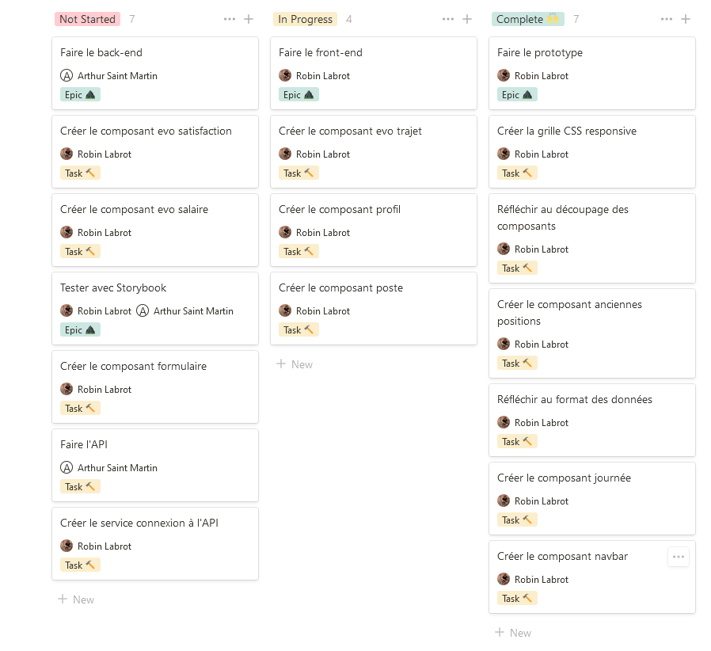
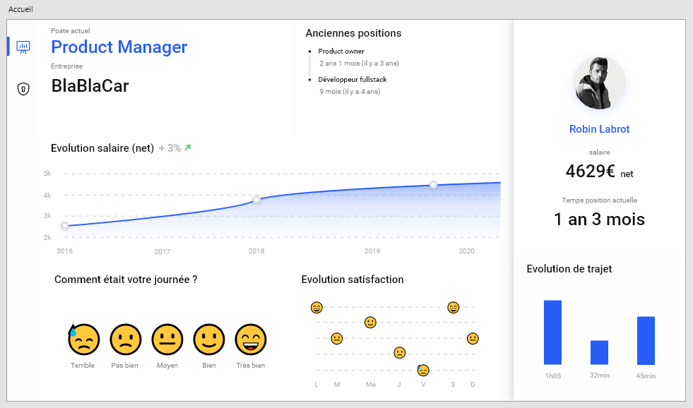
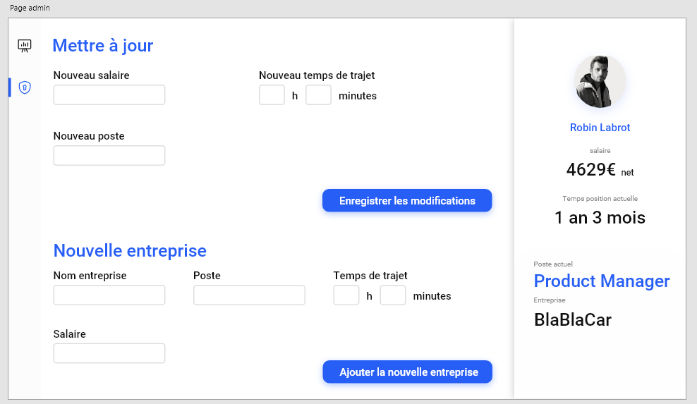

# Projet de fin de semestre - Dashboard de suivi de carrière

Suite aux quelques TPs que nous avons suivi jusqu'ici en ING4, nous avons pu consolider nos connaissances (et même les étendre) lors de ce projet. 
Voici notre dashboard React en SPA responsive , permettant de suivre sa carrière !

### Organisation du travail

Afin de correctement réaliser le projet, nous avons divisé le travail de cette façon :
- Prototype (Robin)
- La partie front (Robin)
- La partie back (Arthur)

Nous avons ensuite divisé les taches et suivi l'évolution du projet en utilisant l'outil Notion.

### Prototypage

En concevant dans un premier temps un design du dashboard avec l'outil Adobe XD en prenant en compte l'expérience utilisateur et appliquer un certain soin à l'UI,
je n'avais plus qu'à reproduire en code le design réalisé.
Les deux autres avantages du prototype étaient:

- **Découpage des composants React** : Avec le prototype, on peut visuellement découper chaque partie en composant et organiser son code dès le départ.
- **Structure des données** : Il était plus simple d'imaginer la structure des données dont nous aurons besoin à partir du prototype

### La partie frontend

La partie frontend est codée grâce au framework Javascript **React.js**.
Paquets NPM utilisées:
- **react-router** : permet le routage 
- **luxon** : gérer plus facilement les dates en JS
- **recharts** : afficher des graphiques facilement
- **storybook** : composants plus robustes

**J'ai décidé de ne pas utiliser Bootstrap** afin d'apprendre à faire des sites responsives en CSS pur sans dépendre d'un framework.
Pour cela, j'ai utilisé une grille CSS et des conteneurs flex.

J'ai commencé par créer la hiéarchie des composants à l'aide du prototype.
Chaque composant ne contenait que son nom et une couleur de fond pour les reconnaitre et les agencés.

J'ai ensuite travailler le responsive en utilisant une grille CSS et des conteneurs flex:

Une fois le responsive correctement réalisé, j'ai déclaré des **données bêtes** en tant que state dans App.js.
Cela va nous faciliter la tâche lorsque nous connecterons l'API au front, je n'aurai qu'à remplacer ces données bêtes par le résultat d'une requête GET.

J'ai ensuite passer en props à tout les composants enfants le state de App.js.

Ensuite, j'ai utilisé react-router pour faire la page admin.

Finalement, j'ai réalisé les composants individuellement.

### La partie backend

La partie backend sera codée en **Javascript** avec l'aide de **Node.JS** en utilisant une base de donnée **MongoDB** (Document-based).

### Comment mettre en route notre projet

1) Cloner ce repo.

2) Exécuter la commande npm install dans **/front**

3) Exécuter la commande npm start dans **/front**

## Auteurs

Réalisé par Robin Labrot, Arthur Saint Martin.
OCRES ING4 2A